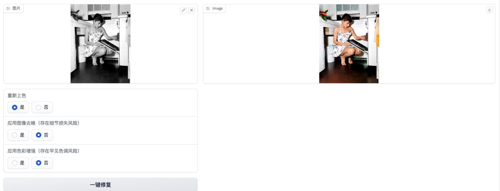
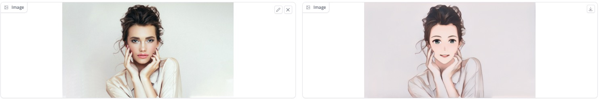

## 介绍
  基于阿里达摩院的https://modelscope.cn/模型封装

## 功能集合
- 一键抠图,一键切换图片背景,旧照片修复,AI人像多风格漫画,多场景文字识别,AI视屏卡通化,中文StableDiffusion-文本生成图像
-  removebg,changebg,repair-photo,human-cartoon,video-cartoon,ocr,cntext2image


### 功能展示
- 一键抠图


<hr>

- 一键切换图片背景

<hr>

- 旧照片修复

<hr>

- AI人像多风格漫画 & AI视屏卡通化

<hr>

- 中文StableDiffusion-文本生成图像

<hr>


## Docker安装，默认仅启用 一键抠图和一键切换图片背景:
```
 docker run --name  modelscope  -p 7860:7860  \
  -v /home/workspace/.cache:/mnt/workspace/.cache     -d   sakoo123/modelscope:1.0

```

## Docker启用全部功能
```
 docker run --name  modelscope  -p 7860:7860  \
 -e  "types=removebg,changebg,repair-photo,human-cartoon,video-cartoon,ocr,cntext2image"  \ 
 -v /home/workspace/.cache:/mnt/workspace/.cache     -d   sakoo123/modelscope:1.0
```

## 开发环境搭建


请参考https://modelscope.cn/docs/环境搭建  准备好初始开发环境

```
再不同版本的python环境下，安装对应版本的tensorflow

conda create -n modelscope python=3.7
conda activate modelscope

pip3 install torch torchvision torchaudio
pip install --upgrade tensorflow==1.15 # 仅支持 CPU 的版本
pip install --upgrade tensorflow-gpu==1.15 # GPU 版


pip install modelscope
pip install "modelscope[multi-modal]"
pip install "modelscope[nlp]" -f https://modelscope.oss-cn-beijing.aliyuncs.com/releases/repo.html
pip install "modelscope[cv]" -f https://modelscope.oss-cn-beijing.aliyuncs.com/releases/repo.html


```
额外安装依赖库

```
pip install gradio 
pip install scikit-image
pip install easydict
pip install fairseq


```

## 验证单个模型
```
    
    命令行输入:   gradio  pages/removebg.py removeBgApplication
    gradio 文件的相对路径  要加载的app名称
    此方法自动感知文件变化，用于开发阶段提高效率

```


## docker build

```
  
  git clone https://github.com/sakoojiang/image-ai.git
  cp image-ai/docker/Dockerfile .
  tar czvf image-ai.tar.gz  image-ai
  docker build -t you-docker-image-name:1.0  .
  
  
```

        
