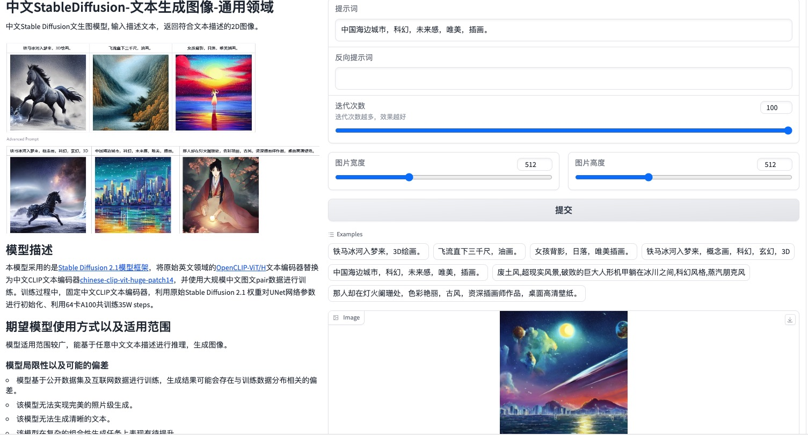

## 介绍
  基于阿里达摩院的https://modelscope.cn/模型封装

## 功能集合
- 一键抠图,一键切换图片背景,旧照片修复,AI人像多风格漫画,多场景文字识别,AI视屏卡通化,中文StableDiffusion-文本生成图像
-  removebg,changebg,repair-photo,human-cartoon,video-cartoon,ocr,cntext2image

## 体验地址
https://sakoo-fuxi-ai.hf.space/?logs=build&__theme=light

### 功能展示
- 一键抠图


- 旧照片修复


- AI人像多风格漫画 & AI视屏卡通化


- 中文StableDiffusion-文本生成图像



## Docker安装，默认仅启用 一键抠图和一键切换图片背景:
```
 docker run --name  modelscope  -p 7860:7860 -e  "XDG_CACHE_HOME=/mnt/workspace/.cache" \
  -v /home/workspace/.cache:/mnt/workspace/.cache     -d   sakoo123/modelscope:1.0

```

## Docker启用全部功能
```
 docker run --name  modelscope  -p 7860:7860 -e  "XDG_CACHE_HOME=/mnt/workspace/.cache" \
 -e  "types=removebg,changebg,repair-photo,human-cartoon,video-cartoon,ocr,cntext2image"  \ 
 -v /home/workspace/.cache:/mnt/workspace/.cache     -d   sakoo123/modelscope:1.0
```

## 开发环境搭建

```
 某些环境下视频卡通画有可能会因为缺少ffmpeg报错
 pip install ffmpeg (or conda install ffmpeg -c conda-forge)
```


请参考https://modelscope.cn/docs/环境搭建  准备好初始开发环境

```
再不同版本的python环境下，安装对应版本的tensorflow

conda create -n modelscope python=3.7
conda activate modelscope

pip3 install torch torchvision torchaudio
pip install --upgrade tensorflow==1.15 # 仅支持 CPU 的版本
pip install --upgrade tensorflow-gpu==1.15 # GPU 版


pip install modelscope
pip install "modelscope[multi-modal]"
pip install "modelscope[nlp]" -f https://modelscope.oss-cn-beijing.aliyuncs.com/releases/repo.html
pip install "modelscope[cv]" -f https://modelscope.oss-cn-beijing.aliyuncs.com/releases/repo.html


```
额外安装依赖库

```
pip install gradio 
pip install scikit-image
pip install easydict
pip install fairseq


```


## docker构建

```

```

        
